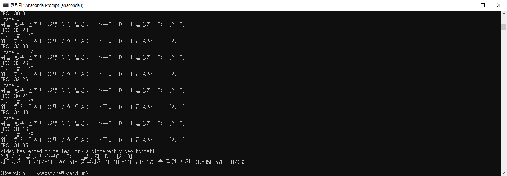

# README

## 사용 기술

- Darknet은 Joseph Redmon이 개발한 C언어 기반 신경망 프레임워크(Neural Network Framework)로써 DNN(Deep Neural Network)들을 학습시키고 실행시킬 수 있는 프레임워크이다.
- YOLO는 딥러닝 기법을 기반으로하는 객체 탐지 알고리즘으로 빠른 속도와 높은 정확도를 보장하여 이미지에서 다중 객체를 탐지할 수 있다.

## 권장 사양

Anaconda 3.7

python 3.7.5

tensorflow 2.3

OPENCV 4.5.2

## step 1. Clone the Repo

컴퓨터에 Git clone 명령어를 이용해서 Repository를 다운받는다.

```bash
git clone https://github.com/AntCode97/BoardRun.git
cd BoardRun
```

## step 2. Prepare Customized Weight File

사람과 전동 스쿠터를 탐지하기 위해 미리 학습시켜놓은 Weight File을 준비한다.

https://github.com/AntCode97/Boardrun_weights

다운로드 한 weight 파일을 이용해서, 텐서플로우 모델을 만든다.

```bash
python save_model.py --weights ./data/MRD.weights --output ./checkpoints/mrd-416 --model yolov4 --tiny
```

## Step 3. Prepare Video File for Detecting Violation

탑승 위반 행위를 탐지하고자하는 영상을 준비해서 video 디렉토리로 이동한다.

## Step 4. Start Detecting Violation Program by Shell

명령 프롬프트 창에서 다음 명령어를 통해 프로그램 실행한다.

python (다중 객체 탐지 python file) --weight (mrd weight file) --model (YOLO version) --video (다중 객체를 탐지하고자 하는 영상) --output (실행 결과를 저장할 위치와 파일 이름 지정)

```bash
python detect_violation.py --weight ./checkpoints/mrd-416 --model yolov4 --video ./data/video/test.mp4 --output ./outputs/result.avi 
```

weight file을 tiny로 사용할 시 --tiny 를 추가하여 실행한다.

```bash
python detect_violation.py --weights ./checkpoints/mrd-416 --model yolov4 --video ./data/video/test.mp4 --output ./outputs/result.avi --tiny True
```

## Step 5. Check the Result

output 디렉토리에서 프로그램이 실행된 결과를 확인한다.

